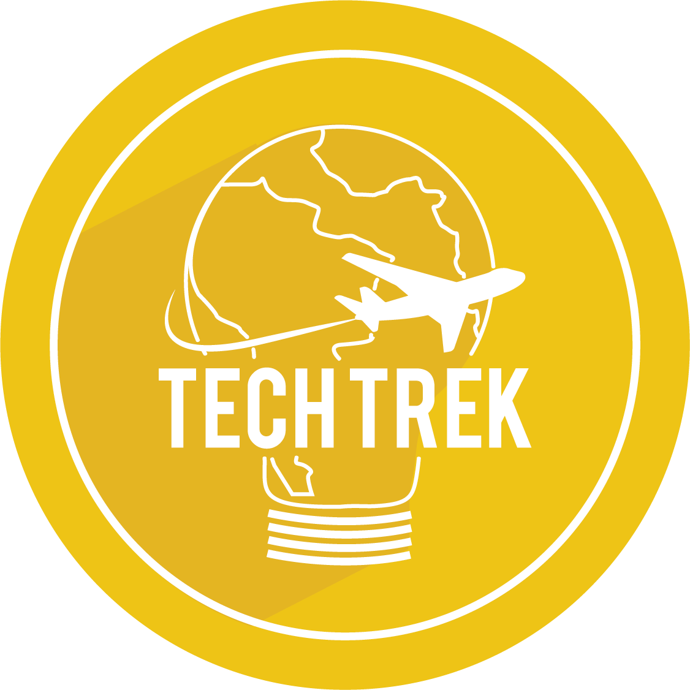

# TT Simon

Simon Says game built for the Tech Trek stand at **ITBA Future Day 2026**.

Players compete for the highest score on a live leaderboard. Built to spark conversations at the event.



## Stack

- **Next.js 16.2.6** (App Router)
- **Tailwind CSS v4** + **Framer Motion**
- **Neon Postgres** + **Drizzle ORM**
- **Web Audio API** — classic Simon tones synthesized in-browser, no audio files

## Game

- 4 buttons (green, red, yellow, blue) arranged as pie slices
- Speed ramps up gradually after score 4, maxes out around score 20
- Timer bar per button press — gold → orange → red as time runs out
- Multilingual funny messages during pattern display (ES, EN, JP, KO, RU, PT, IT, SV, TH, DE, FR)
- Live leaderboard: podium messages for top 3, context table for #4+

## Development

```bash
npm install
cp .env.local.example .env.local
# fill in DATABASE_URL from Neon dashboard
npm run db:migrate
npm run dev
```

## Deploy

Hosted on Vercel. Set `DATABASE_URL` in the Vercel dashboard, then:

```bash
vercel deploy
```

---

Made with ❤️ by [Tech Trek ITBA](https://techtrek-web.vercel.app)
